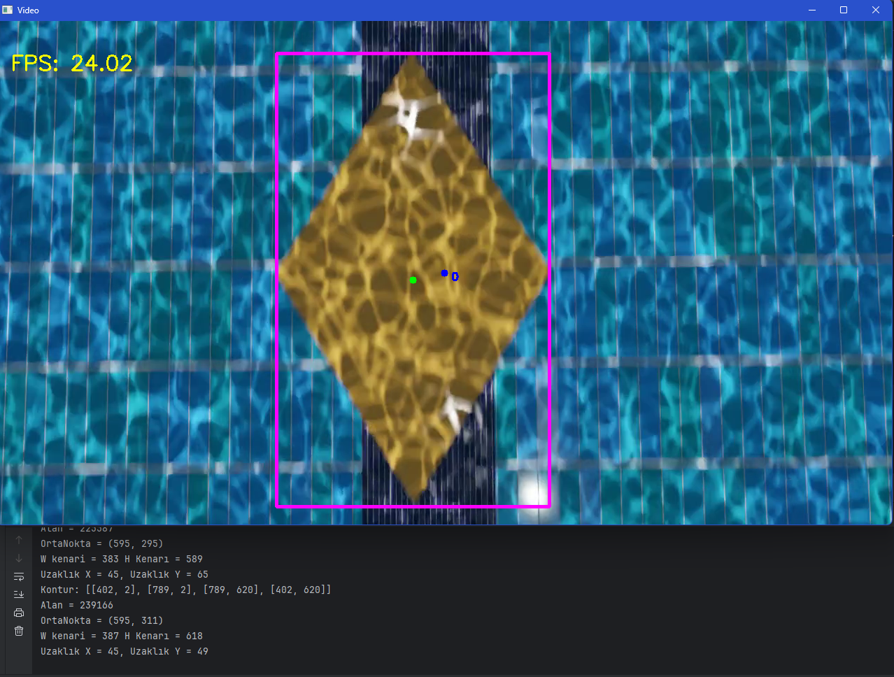

# freshman-yolo-shape-detection

Early YOLO-based object detection and target-centering system developed under severe hardware constraints
for the **TEKNOFEST Unmanned Underwater Systems Competition (Advanced Category)**.

# Freshman YOLO Shape Detection Project

⚠️ This project was developed during my **freshman year (1st year)** as part of a TEKNOFEST competition study.
The goal was not to build a production-ready vision system, but to explore object detection and
target-centering concepts for **underwater robotic systems** under **severe hardware constraints**.

---

## Project Overview

This project uses a YOLO-based (YOLOv8-tiny) object detection model to detect geometric shapes
in a **simulated underwater pool environment**.

Instead of performing full classification continuously, the system focuses on:
- Detecting objects in the frame
- Calculating their center position
- Waiting until the object aligns with the image center
- Capturing snapshots for further offline processing

This approach was chosen due to limited onboard computational resources.

---

## Motivation & System Design

The onboard vehicle hardware (**NVIDIA Jetson Nano + STM32F407G-DISC1**) was only capable of running
object detection at approximately **3 FPS**, which made real-time classification unreliable.

To overcome this limitation, a lightweight strategy was implemented:

- Continuous detection with minimal processing
- Center-based target selection
- Snapshot capture only when alignment conditions are met
- Offline labeling and further processing on a more capable system (Jetson Nano)

Although simple, this method proved to be **robust under constrained conditions**
and significantly improved overall detection reliability.

---

## Detection and Target Centering

The system detects objects, calculates their center, and captures snapshots
only when alignment conditions are met.

  

(Bounding box detection and center alignment visualization)

---

## Demo Video

A short demonstration video showing the detection and centering logic is available below:

[▶ Watch demo video](assets/output_video_longer.mp4)

---

## How to Run

1. Install dependencies:

    pip install -r requirements.txt

2. Place your input video in the project root directory  
   (or update the VIDEO_PATH variable in the code)

3. Run the main script:

    python underwater_object_detection.py

Generated outputs:
- Processed output video
- Snapshot images captured for each detected class when center alignment conditions are met

---

## Classes

The model was trained to detect the following geometric shapes:

- Triangle
- Square
- Rectangle
- Circle
- Ellipse
- Pentagon
- Hexagon
- Rhombus
- Star
- Clover

---

## Performance Notes

- Development PC: ~24 FPS  
- Onboard vehicle system: ~3 FPS  

Due to these limitations, real-time classification was avoided in favor of snapshot-based processing.

---

## Limitations

- Original training dataset was not preserved
- Training pipeline is not fully reproducible
- Testing was performed only in a simulated environment (created by a teammate using Blender)
- Detection accuracy was not fully optimized

These limitations are expected given the scope and timeframe of the project.

---

## What I Would Improve Today

If I were to revisit this project today, I would focus on:

- Better dataset collection and versioning
- Explicit class label visualization for all detections
- Real-world underwater testing
- Cleaner and more modular code architecture
- Optimized inference pipeline for embedded hardware

---

## Technologies Used

- Python
- OpenCV
- YOLO (Ultralytics)
- NumPy

---

## Competition Note

This project advanced to the **final stage** of the TEKNOFEST
Unmanned Underwater Systems Competition (**state-recognized finalist**).

The official finalist certificate is available in the /docs directory.

---

## Disclaimer

This repository represents an **early-stage learning project** and does not reflect my current technical level.
It is shared for documentation and educational purposes.

The included YOLO model and code are provided under the MIT License.
Model weights are included for demonstration purposes only.
